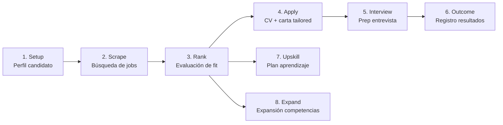

# Open AI Jobs Search — FastAPI Backend

Backend multi-proveedor de IA para búsqueda de empleos. Reimplementa como servicio Python el framework de `ai-job-search` (originalmente comandos de Claude Code).

## Stack

- **FastAPI** (async) + **Pydantic v2** + **SQLAlchemy 2.0** (async, asyncpg)
- **LiteLLM** — capa adaptadora multi-proveedor (Anthropic, OpenAI, NVIDIA NIM, LM Studio)
- **Supabase** (PostgreSQL) — Session Pooler o Direct Connection
- **APScheduler** — scraping periódico
- **Bun/TypeScript** scrapers heredados del repo fuente (invocados vía subprocess)
- **LaTeX** (lualatex + xelatex) — generación de CV y cartas tailored

## Estructura

```
FastAPI-backend/
├── app/
│   ├── main.py              # app factory: create_app()
│   ├── core/                # config, settings, seguridad
│   ├── llm/                 # adaptador LiteLLM
│   ├── db/                  # SQLAlchemy models, session, alembic
│   ├── schemas/             # Pydantic request/response
│   ├── services/            # lógica de negocio (un módulo por skill)
│   ├── external/            # scrapers Bun/TS + LaTeX heredados
│   ├── api/
│   │   ├── deps.py          # get_db, get_current_user, get_llm_provider
│   │   └── v1/              # routers versionados
│   └── exceptions.py        # excepciones de negocio + handlers
├── tests/
│   ├── unit/
│   └── integration/
├── alembic/                 # migraciones de base de datos
├── pyproject.toml
├── alembic.ini
└── .env.example
```

## Prerequisites

Además de Python 3.11+, esta app requiere dependencias del sistema para funcionalidad completa:

| Componente | Propósito | Instalación |
|------------|-----------|-------------|
| **Bun** | Ejecutar scrapers heredados (Bun/TS) | `npm install -g bun` |
| **LaTeX** (lualatex + xelatex) | Compilar CV y cartas tailored | TeX Live o MiKTeX |
| **Supabase** | Base de datos PostgreSQL | Proyecto en supabase.com |
| **LLM Provider** | API key para LiteLLM (Anthropic, OpenAI, etc.) | Variable en `.env` |

> **Nota:** Sin Bun, el endpoint `/scrape/` no funcionará. Sin LaTeX, el endpoint `/apply/` no podrá generar PDFs. Sin Supabase, la app no tiene persistencia.

## Setup

```bash
# 1. Crear entorno virtual
python -m venv .venv
source .venv/bin/activate  # o .venv\Scripts\activate en Windows

# 2. Instalar dependencias Python
pip install -e ".[dev]"

# 3. Configurar variables de entorno
cp .env.example .env
# Editar .env con tu DATABASE_URL de Supabase y API keys

# 4. Ejecutar migraciones
alembic upgrade head

# 5. Arrancar el servidor de desarrollo
uvicorn app.main:create_app --factory --reload
```

El servidor se levanta en `http://127.0.0.1:8000`.
Healthcheck: `GET http://127.0.0.1:8000/api/v1/health`

## Migraciones (Alembic)

```bash
alembic revision --autogenerate -m "descripción del cambio"  # generar migración
alembic upgrade head                                          # aplicar migraciones
alembic history                                               # ver historial
```

## Endpoints

Todos los endpoints están versionados bajo `/api/v1/`. La autenticación (cuando se requiera) se provee vía `api/deps.py` (`get_current_user`).

### Health
| Método | Ruta | Descripción |
|--------|------|-------------|
| GET | `/api/v1/health` | Liveness probe |

### Setup — Perfil del candidato
| Método | Ruta | Descripción |
|--------|------|-------------|
| POST | `/api/v1/setup/profile` | Crear perfil candidato |
| GET | `/api/v1/setup/profile` | Obtener perfil |
| PATCH | `/api/v1/setup/profile` | Actualizar perfil |
| DELETE | `/api/v1/setup/profile` | Eliminar perfil |
| POST | `/api/v1/setup/profile/complete` | Marcar perfil como completo |
| GET | `/api/v1/setup/behavioral-profile` | Obtener perfil conductual |
| PUT | `/api/v1/setup/behavioral-profile` | Actualizar perfil conductual |
| GET | `/api/v1/setup/star-examples` | Listar ejemplos STAR |
| POST | `/api/v1/setup/star-examples` | Crear ejemplo STAR |
| DELETE | `/api/v1/setup/star-examples/{example_id}` | Eliminar ejemplo STAR |

### Scrape — Búsqueda de empleos
| Método | Ruta | Descripción |
|--------|------|-------------|
| POST | `/api/v1/scrape/` | Ejecutar scraping (portal + query) |
| GET | `/api/v1/scrape/runs` | Listar corridas de scraping |
| GET | `/api/v1/scrape/jobs` | Listar jobs encontrados |
| GET | `/api/v1/scrape/jobs/{job_id}` | Obtener detalle de un job |

### Rank — Evaluación de fit + shortlist
| Método | Ruta | Descripción |
|--------|------|-------------|
| POST | `/api/v1/rank/` | Ejecutar ranking (focus_area, re_rank, top_n) |
| GET | `/api/v1/rank/jobs` | Listar jobs rankeados (filtros: min_score, verdict) |
| GET | `/api/v1/rank/jobs/{job_id}/evaluation` | Obtener evaluación de un job |

### Apply — Generación de CV/carta tailored
| Método | Ruta | Descripción |
|--------|------|-------------|
| POST | `/api/v1/apply/` | Generar aplicación (CV + carta LaTeX) |
| GET | `/api/v1/apply/{application_id}` | Obtener aplicación por ID |
| GET | `/api/v1/apply/` | Listar aplicaciones |

### Interview — Preparación de entrevistas
| Método | Ruta | Descripción |
|--------|------|-------------|
| POST | `/api/v1/interview/` | Generar prep de entrevista |
| GET | `/api/v1/interview/{prep_id}` | Obtener prep por ID |
| GET | `/api/v1/interview/` | Listar preps |

### Outcome — Registro de resultados
| Método | Ruta | Descripción |
|--------|------|-------------|
| POST | `/api/v1/outcome/` | Registrar outcome (estado de aplicación) |
| PATCH | `/api/v1/outcome/{outcome_id}` | Actualizar outcome |
| GET | `/api/v1/outcome/{outcome_id}` | Obtener outcome por ID |
| GET | `/api/v1/outcome/` | Listar outcomes |
| GET | `/api/v1/outcome/tracker/rows` | Filas del tracker (CSV-like) |

### Expand — Expansión de competencias
| Método | Ruta | Descripción |
|--------|------|-------------|
| POST | `/api/v1/expand/` | Expandir competencias (CV, LinkedIn, diplomas, refs, GitHub) |
| GET | `/api/v1/expand/{expansion_id}` | Obtener expansión por ID |
| GET | `/api/v1/expand/` | Listar expansiones |

### Upskill — Plan de aprendizaje
| Método | Ruta | Descripción |
|--------|------|-------------|
| POST | `/api/v1/upskill/` | Ejecutar análisis upskill (aggregate o targeted) |
| GET | `/api/v1/upskill/{upskill_id}` | Obtener análisis por ID |
| GET | `/api/v1/upskill/` | Listar análisis |

### Add-portal / Add-template / Reset — Configuración
| Método | Ruta | Descripción |
|--------|------|-------------|
| POST | `/api/v1/add-portal/` | Registrar nuevo portal de scraping |
| GET | `/api/v1/add-portal/{skill_name}` | Obtener portal por skill |
| GET | `/api/v1/add-portal/` | Listar portales |
| POST | `/api/v1/add-template/` | Registrar template LaTeX |
| POST | `/api/v1/add-template/switch` | Cambiar template activo |
| GET | `/api/v1/add-template/{template_type}/{name}` | Obtener template |
| GET | `/api/v1/add-template/` | Listar templates |
| POST | `/api/v1/reset/` | Resetear datos del usuario |

## Flujo de la API — Orden recomendado para el cliente

La API está diseñada como un pipeline secuencial: cada fase produce datos que consume la siguiente. Un cliente que use la app por primera vez debe seguir este orden:



### Paso 1 — Setup (obligatorio, primero)
El cliente **debe** crear su perfil de candidato antes de cualquier otra operación. Sin perfil, los endpoints posteriores fallan con `ProfileIncompleteError`.

1. `POST /api/v1/setup/profile` — crear perfil (nombre, experiencia, skills, educación, etc.)
2. `POST /api/v1/setup/profile/complete` — marcar como completo (habilita el resto del pipeline)
3. Opcional: `PUT /api/v1/setup/behavioral-profile` — perfil conductual para ranking más preciso
4. Opcional: `POST /api/v1/setup/star-examples` — ejemplos STAR para entrevistas

### Paso 2 — Scrape (buscar empleos)
Una vez con perfil, el cliente busca jobs en uno o varios portales:

- `POST /api/v1/scrape/` con `{ portal, query, location? }` — lanza scraping (invoca scrapers Bun/TS por subprocess)
- `GET /api/v1/scrape/jobs` — consulta los jobs encontrados (status `new`)

### Paso 3 — Rank (evaluar fit)
Con jobs en estado `new`, el cliente los evalúa:

- `POST /api/v1/rank/` con `{ focus_area?, re_rank?, top_n? }` — el LLM evalúa cada job (technical, experience, behavioral, career) y arma un shortlist
- `GET /api/v1/rank/jobs?min_score=&verdict=` — filtra el shortlist
- Los jobs pasan a status `ranked` con `rank_score` y `rank_verdict`

### Paso 4 — Apply (generar CV/carta)
Para cada job del shortlist que el cliente quiera aplicar:

- `POST /api/v1/apply/` con `{ job_posting_id }` — genera CV + carta tailored en LaTeX (lualatex/xelatex), optimizado ATS
- `GET /api/v1/apply/{application_id}` — descarga/recupera la aplicación generada

### Paso 5 — Interview (preparar entrevista)
Cuando el cliente consigue una entrevista:

- `POST /api/v1/interview/` con `{ application_id }` — genera prep con preguntas probables, brief de consistencia y ejemplos STAR
- `GET /api/v1/interview/{prep_id}` — recupera la prep

### Paso 6 — Outcome (registrar resultado)
Después de la entrevista, el cliente registra el resultado:

- `POST /api/v1/outcome/` — registra estado (rejected, offer, etc.)
- `PATCH /api/v1/outcome/{outcome_id}` — actualiza estado
- `GET /api/v1/outcome/tracker/rows` — vista tipo tracker de todas las aplicaciones

### Pasos opcionales (paralelos a Rank)
- **Upskill** (`POST /api/v1/upskill/`): análisis de gaps de skills y plan de aprendizaje. Modo `aggregate` (todos los jobs rankeados) o `targeted` (un job específico).
- **Expand** (`POST /api/v1/expand/`): expande competencias del candidato escaneando CV, LinkedIn, diplomas, referencias y GitHub.

### Configuración (independiente del flujo)
- `POST /api/v1/add-portal/` — registrar nuevos portales de scraping
- `POST /api/v1/add-template/` — registrar/cambiar templates LaTeX
- `POST /api/v1/reset/` — resetear todos los datos del usuario (empezar de cero)

## Convenciones de diseño

- **`main.py` es una app factory** (`create_app()`), no `app = FastAPI()` a nivel de módulo.
- **`schemas/` vs `db/models.py`**: nunca exponer ORM directo. Cada recurso tiene `XCreate`, `XUpdate`, `XOut`.
- **`api/deps.py`**: dependencias centralizadas (`get_db`, `get_current_user`, `get_llm_provider`).
- **`api/v1/`**: versionado desde el arranque.
- **`exceptions.py`**: excepciones de negocio con handlers registrados. No `HTTPException` sueltas en servicios.
- **LLM siempre vía `app/llm/adapter.py`** — nunca SDK directo de proveedor.
- **Scrapers Bun/TS** se invocan por subprocess desde `app/services/scrape/`, no se reescriben.

## Constraints

- **Repo fuente `ai-job-search` es SOLO LECTURA** — nunca modificar.
- **Secrets en `.env`**, nunca hardcodeados ni commiteados.
- **NO usar Transaction Pooler** de PgBouncer con asyncpg (rompe prepared statements). Usar Session Pooler o Direct Connection.
- **`DATABASE_URL` debe usar `postgresql+asyncpg://`** cuando se emplea `create_async_engine()` de SQLAlchemy 2.x. El scheme `postgresql://` hace que SQLAlchemy intente cargar `psycopg2` (síncrono) y falla con `InvalidRequestError`.
- **Los routers deben importar schemas desde `app.schemas.*`**, no desde `app.services.*`, para los `response_model` de FastAPI.

## Testing

```bash
pytest tests/unit/                    # tests unitarios (SQLite in-memory + mocks)
pytest tests/unit/test_rank.py        # un módulo específico
pytest --tb=short -q --disable-warnings  # salida concisa
```

Los tests usan SQLite en memoria y mockean las llamadas al LLM, así que no requieren credenciales reales ni conexión a Supabase.
