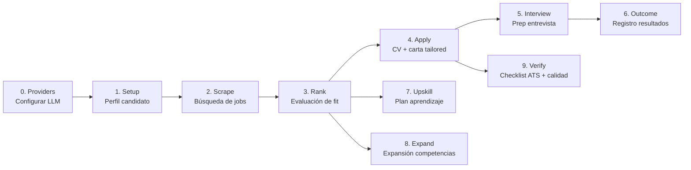

# Career OS — FastAPI Backend

Backend multi-proveedor de IA para la búsqueda automatizada de empleo. Orquesta un pipeline completo: desde el scraping de portales hasta la generación de CV/cover letter optimizados para ATS, preparación de entrevistas y tracking de resultados.

> **Inspirado en:** [MadsLorentzen/ai-job-search](https://github.com/MadsLorentzen/ai-job-search)

---

## Tabla de contenidos

- [Stack](#stack)
- [Arquitectura](#arquitectura)
- [Pipeline completo](#pipeline-completo)
- [Estructura](#estructura)
- [Prerrequisitos](#prerrequisitos)
- [Setup](#setup)
- [Migraciones (Alembic)](#migraciones-alembic)
- [Endpoints](#endpoints)
- [LLM Orchestrator](#llm-orchestrator)
- [Drafter-Reviewer Pipeline](#drafter-reviewer-pipeline)
- [Variables de entorno](#variables-de-entorno)
- [Testing](#testing)
- [Deployment](#deployment)
- [Convenciones de diseño](#convenciones-de-diseño)

---

## Stack

- **FastAPI** (async) + **Pydantic v2** + **SQLAlchemy 2.0** (async, asyncpg)
- **LiteLLM** — capa adaptadora multi-proveedor (Anthropic, OpenAI, NVIDIA NIM, Groq, OpenRouter, LM Studio, Ollama)
- **LLMOrchestrator** — sistema de colas, failover automático, rate limiting, health monitoring, WebSocket real-time
- **Supabase** (PostgreSQL) — Session Pooler o Direct Connection
- **APScheduler** — scraping periódico
- **Bun/TypeScript** scrapers (linkedin, jobindex, jobnet, jobdanmark, freehire, jobbank)
- **LaTeX** (lualatex + xelatex) — generación de CV y cover letters tailored
- **i18n** — soporte multi-idioma (en, es) con detección automática vía Accept-Language/cookie
- **WebSocket** — notificaciones real-time del estado de la cola de ejecución
- **Fernet** (cryptography) — cifrado de API keys por usuario en DB

---

## Arquitectura

```
┌──────────────────────────────────────────────────────────────────┐
│                     LLMOrchestrator                               │
│  ┌──────────────┐  ┌──────────────┐  ┌───────────────────────┐  │
│  │ Provider     │  │ Model        │  │ ExecutionQueue        │  │
│  │ Manager      │  │ Manager      │  │ (concurrency,         │  │
│  │ (health,     │  │ (states,     │  │  checkpointing,       │  │
│  │  priorities, │  │  selection,  │  │  persistence)         │  │
│  │  cooldowns)  │  │  costs)      │  │                       │  │
│  └──────────────┘  └──────────────┘  └───────────────────────┘  │
│  ┌──────────────┐  ┌──────────────────────────────────────────┐ │
│  │ QueueNotifier│  │ LLMResponseSanitizer                     │ │
│  │ (WebSocket   │  │ (repair JSON, truncate arrays,           │ │
│  │  real-time)  │  │  fill defaults before Pydantic)          │ │
│  └──────────────┘  └──────────────────────────────────────────┘ │
└──────────────────────────────────────────────────────────────────┘
         │
         ▼
┌──────────────────────────────────────────────────────────────────┐
│                      Services Layer                               │
│  Scrape → Rank → Apply → Interview → Outcome → Upskill           │
│  Expand → Verification → ATS Check → CV Cutter → PDF Compiler    │
│  Fit Calibration → Salary Benchmarking → Pipeline Reset          │
└──────────────────────────────────────────────────────────────────┘
         │
         ▼
┌──────────────────────────────────────────────────────────────────┐
│                    Deterministic Analyzers                        │
│  RankAnalyzer │ SkillLinter │ ContentGuard │ PDFVerifier         │
│  SalaryLookup │ KeywordExtractor │ AtsChecker                   │
└──────────────────────────────────────────────────────────────────┘
         │
         ▼
┌──────────────────────────────────────────────────────────────────┐
│                    Cross-Cutting                                  │
│  i18n (en/es) │ Middleware (PII guard) │ Dashboard & Analytics   │
└──────────────────────────────────────────────────────────────────┘
```

### Principios arquitectónicos

1. **El LLM es un componente del pipeline, no el centro.** Todo lo que puede resolverse con algoritmos deterministas (keyword extraction, score normalization, ATS checks, skill linting, content validation) se implementa sin LLM.

2. **Failover automático.** Si un proveedor responde 429, timeout o error, el orquestador cambia automáticamente al siguiente modelo/proveedor sin interrumpir la cola.

3. **Checkpoints persistentes.** Cada job se persiste en DB. Si el backend se reinicia, retoma desde el último checkpoint. Nunca desde cero.

4. **Sanitización antes de validación.** Las respuestas del LLM se sanitizan (truncar arrays, trim strings, reparar JSON, llenar defaults) ANTES de pasarlas por Pydantic. Solo se rechazan respuestas irrecuperables.

---

## Pipeline completo



### Fase 0 — Provider Setup
Cada usuario configura su propio proveedor LLM (API key + modelo). Las credenciales se cifran con Fernet y se almacenan por usuario.

### Fase 1 — Setup (perfil candidato)
Perfil completo: datos personales, experiencia, educación, skills, **perfil conductual** (DISC, fortalezas, áreas de crecimiento), y **ejemplos STAR** para entrevistas.

### Fase 2 — Scrape
Scraping multi-portal vía scrapers Bun/TS. Deduplicación automática por `(portal, external_id)`. Los scrapers corren en paralelo via `asyncio.gather`.

### Fase 3 — Rank (evaluación de fit)
Evaluación multi-dimensión usando el **RankAnalyzer** determinista:
- **Técnico**: keyword overlap, experiencia requerida, skills matching
- **Experiencia**: años, seniority, industrias relevantes
- **Comportamental**: alineación con perfil conductual
- **Carrera**: salario (si hay datos), ubicación, modalidad (remote/hybrid)
- **Fit general**: combinación ponderada + qualitative reasoning del LLM

### Fase 4 — Apply (generación de documentos)
**Pipeline Drafter-Reviewer-Revise** de 3 etapas:
1. **Drafter**: genera CV + cover letter en LaTeX adaptados al posting específico
2. **Reviewer**: agente con contexto fresco que investiga la empresa y critica los drafts buscando keywords faltantes, framing débil, claims inventados, lenguaje genérico
3. **Revise**: el drafter recibe el feedback y corrige

Luego de la revisión:
- **CV Cutter**: si el CV supera 2 páginas, corta bullets por relevancia (keyword overlap + unicidad + referencias en cover letter)
- **Compilación**: `lualatex` para CV, `xelatex` para cover letter, con verificación de páginas y orphans
- **ATS Check**: verifica parseabilidad del PDF (sin `(cid:*)` markers, keyword coverage ≥70%, orden de lectura correcto)
- **Verification Checklist**: 10+ checks deterministas + LLM para consistencia y claims fabricados

### Fase 5 — Interview (preparación)
Prep pack completo: research de empresa, preguntas probables mapeadas a ejemplos STAR del candidato, bridge answers para gaps de experiencia, **mock interview** (chat interactivo donde el LLM juega el rol del entrevistador).

### Fase 6 — Outcome (tracking)
Registro de resultados: entrevista, oferta, rechazo, silencio. Calibración del fit framework basada en qué realmente consiguió entrevistas.

### Fase 7 — Upskill (análisis de gaps)
4-pass analysis: hard gaps → synthesis → heatmap → learning plan. Compara skills del perfil contra los requerimientos de todos los jobs rankeados.

### Fase 8 — Expand (enriquecimiento de perfil)
Escanea fuentes públicas (GitHub, portfolio, LinkedIn) para descubrir competencias no explícitas en el CV.

---

## Estructura

```
FastAPI-backend/
├── app/
│   ├── main.py                    # app factory: create_app()
│   ├── core/                      # config, settings, seguridad, scheduler
│   ├── llm/                       # adaptador LiteLLM
│   ├── db/
│   │   ├── models.py              # SQLAlchemy models (~30 tablas)
│   │   └── session.py             # async engine + session factory
│   ├── schemas/                   # Pydantic v2 request/response
│   ├── services/                  # Lógica de negocio (~20 módulos)
│   │   ├── rank.py                # Ranking + RankAnalyzer determinista
│   │   ├── apply.py               # Drafter-Reviewer-Revise pipeline
│   │   ├── interview.py           # Prep + mock interview
│   │   ├── outcome.py             # Tracking + fit calibration
│   │   ├── upskill.py             # Skill gap analysis
│   │   ├── expand.py              # Perfil enrichment
│   │   ├── verification.py        # Verification checklist
│   │   ├── ats_check.py           # ATS parseability
│   │   ├── cv_cutter.py           # Relevance-weighted trimming
│   │   ├── pdf_compiler.py        # LaTeX compilation loop
│   │   ├── pipeline_reset.py      # Clean slate reset
│   │   ├── provider_credentials.py # Fernet-encrypted creds
│   │   ├── provider_models.py     # Model catalog per provider
│   │   ├── salary/                # Salary benchmarking
│   │   ├── scrape.py              # Web scraping orchestration
│   │   └── setup.py               # Candidate profile management
│   ├── utils/                     # Utility tools
│   │   ├── pdf_verifier.py        # ATS verify wrapper
│   │   ├── skill_linter.py        # Skill validation (~120 known skills)
│   │   └── __init__.py
│   ├── middleware/
│   │   └── content_guard.py       # PII detection in LLM outputs
│   ├── external/                  # Scrapers Bun/TS + LaTeX heredados
│   ├── api/
│   │   ├── deps.py                # get_db, get_current_user
│   │   └── v1/                    # Routers versionados (~15 routers)
│   └── exceptions.py              # Excepciones centralizadas
├── tests/
│   ├── unit/                      # ~367 tests (SQLite in-memory + mocks)
│   └── integration/               # Tests de integración
├── alembic/                       # Migraciones DB
├── pyproject.toml
└── Dockerfile                     # Multi-stage (builder + runtime con MiKTeX)
```

---

## Prerrequisitos

| Componente | Propósito | Instalación |
|------------|-----------|-------------|
| **Python 3.11+** | Runtime | `python.org` o `pyenv` |
| **Bun** | Ejecutar scrapers TS heredados | `npm install -g bun` |
| **LaTeX** (lualatex + xelatex) | Compilar CV y cover letters | MiKTeX o TeX Live |
| **Supabase** | Base de datos PostgreSQL | Proyecto en supabase.com |
| **LLM Provider** | API key (Anthropic, OpenAI, NVIDIA, Groq, OpenRouter, etc.) | Según provider |

---

## Setup

```bash
# 1. Entorno virtual
python -m venv .venv
source .venv/bin/activate  # Windows: .venv\Scripts\activate

# 2. Instalar dependencias
pip install -e ".[dev]"

# 3. Variables de entorno
cp .env.example .env
# Editar DATABASE_URL, JWT_SECRET_KEY y API keys

# 4. Migraciones
alembic upgrade head

# 5. Servidor de desarrollo
uvicorn app.main:create_app --factory --reload
```

Servidor en `http://127.0.0.1:8000`. Healthcheck: `GET /api/v1/health`

---

## Migraciones (Alembic)

```bash
alembic revision --autogenerate -m "descripción"
alembic upgrade head
alembic history
```

---

## Endpoints

### Health

| Método | Ruta | Descripción |
|--------|------|-------------|
| GET | `/api/v1/health` | Liveness probe |

### Auth

| Método | Ruta | Descripción |
|--------|------|-------------|
| POST | `/api/v1/auth/register` | Registro de usuario |
| POST | `/api/v1/auth/login` | Login (devuelve JWT) |

### Providers — Configuración LLM

| Método | Ruta | Descripción |
|--------|------|-------------|
| GET | `/api/v1/providers/` | Catálogo de proveedores conocidos |
| POST | `/api/v1/providers/` | Guardar credencial cifrada |
| GET | `/api/v1/providers/me` | Proveedores del usuario |
| GET | `/api/v1/providers/me/active` | Proveedor activo actual |
| PUT | `/api/v1/providers/active` | Cambiar proveedor activo |
| PATCH | `/api/v1/providers/{provider}` | Actualizar credencial parcial |
| DELETE | `/api/v1/providers/{provider}` | Eliminar credencial |

### Setup — Perfil del candidato

| Método | Ruta | Descripción |
|--------|------|-------------|
| POST | `/api/v1/setup/profile` | Crear perfil |
| GET | `/api/v1/setup/profile` | Obtener perfil |
| PATCH | `/api/v1/setup/profile` | Actualizar perfil |
| DELETE | `/api/v1/setup/profile` | Eliminar perfil |
| POST | `/api/v1/setup/profile/complete` | Marcar completo |
| GET | `/api/v1/setup/behavioral-profile` | Perfil conductual (DISC, fortalezas) |
| PUT | `/api/v1/setup/behavioral-profile` | Actualizar perfil conductual |
| GET | `/api/v1/setup/star-examples` | Listar ejemplos STAR |
| POST | `/api/v1/setup/star-examples` | Crear ejemplo STAR |
| DELETE | `/api/v1/setup/star-examples/{id}` | Eliminar ejemplo STAR |

### Scrape — Búsqueda de empleos

| Método | Ruta | Descripción |
|--------|------|-------------|
| POST | `/api/v1/scrape/` | Ejecutar scraping multi-portal |
| GET | `/api/v1/scrape/runs` | Historial de corridas |
| GET | `/api/v1/scrape/jobs` | Jobs encontrados (filtros: status, portal) |
| GET | `/api/v1/scrape/jobs/{job_id}` | Detalle de un job |

### Rank — Evaluación de fit

| Método | Ruta | Descripción |
|--------|------|-------------|
| POST | `/api/v1/rank/` | Ejecutar ranking (focus_area, re_rank, top_n) |
| GET | `/api/v1/rank/jobs` | Jobs rankeados (filtros: min_score, verdict) |
| GET | `/api/v1/rank/jobs/{job_id}/evaluation` | Evaluación completa de un job |

### Apply — Generación de CV/carta

| Método | Ruta | Descripción |
|--------|------|-------------|
| POST | `/api/v1/apply/` | Generar aplicación (pipeline drafter-reviewer) |
| GET | `/api/v1/apply/{application_id}` | Obtener aplicación por ID |
| GET | `/api/v1/apply/` | Listar aplicaciones |
| GET | `/api/v1/apply/{application_id}/status` | Estado del pipeline de generación |
| POST | `/api/v1/apply/{application_id}/verify` | Ejecutar verification checklist |
| GET | `/api/v1/apply/{application_id}/verify` | Resultado de verificación |

### Interview — Preparación de entrevistas

| Método | Ruta | Descripción |
|--------|------|-------------|
| POST | `/api/v1/interview/` | Generar prep pack |
| GET | `/api/v1/interview/{prep_id}` | Obtener prep por ID |
| GET | `/api/v1/interview/` | Listar preps |
| POST | `/api/v1/interview/{prep_id}/mock` | Iniciar mock interview |
| POST | `/api/v1/interview/{prep_id}/mock` | Enviar respuesta (pasa la conversación) |

### Outcome — Registro de resultados

| Método | Ruta | Descripción |
|--------|------|-------------|
| POST | `/api/v1/outcome/` | Registrar outcome |
| PATCH | `/api/v1/outcome/{outcome_id}` | Actualizar outcome |
| GET | `/api/v1/outcome/{outcome_id}` | Obtener outcome |
| GET | `/api/v1/outcome/` | Listar outcomes |
| GET | `/api/v1/outcome/tracker/rows` | Filas del tracker (CSV-like) |

### Expand — Expansión de competencias

| Método | Ruta | Descripción |
|--------|------|-------------|
| POST | `/api/v1/expand/` | Expandir competencias (CV, LinkedIn, diplomas, GitHub) |
| GET | `/api/v1/expand/{expansion_id}` | Obtener expansión por ID |
| GET | `/api/v1/expand/` | Listar expansiones |

### Upskill — Plan de aprendizaje

| Método | Ruta | Descripción |
|--------|------|-------------|
| POST | `/api/v1/upskill/` | Ejecutar análisis (aggregate o targeted) |
| GET | `/api/v1/upskill/{upskill_id}` | Obtener análisis por ID |
| GET | `/api/v1/upskill/` | Listar análisis |

### Salary — Benchmarking salarial

| Método | Ruta | Descripción |
|--------|------|-------------|
| POST | `/api/v1/salary/data` | Cargar datos de salario (JSON o Excel) |
| GET | `/api/v1/salary/data` | Obtener datos de salario del usuario |
| DELETE | `/api/v1/salary/data` | Eliminar datos de salario |

### Pipeline Reset

| Método | Ruta | Descripción |
|--------|------|-------------|
| DELETE | `/api/v1/pipeline-reset` | Resetear pipeline (borra jobs, runs, métricas) |

### Orchestrator — Monitoreo y control

| Método | Ruta | Descripción |
|--------|------|-------------|
| GET | `/api/v1/orchestrator/status` | Estado general del orquestador |
| GET | `/api/v1/orchestrator/providers` | Estado de todos los proveedores |
| POST | `/api/v1/orchestrator/providers/{provider}/toggle` | Habilitar/deshabilitar proveedor |
| GET | `/api/v1/orchestrator/queue` | Estado de la cola de ejecución |
| POST | `/api/v1/orchestrator/pause` | Pausar cola |
| POST | `/api/v1/orchestrator/resume` | Reanudar cola |
| POST | `/api/v1/orchestrator/cancel/{job_id}` | Cancelar job |
| POST | `/api/v1/orchestrator/retry/{job_id}` | Reintentar job fallido |
| POST | `/api/v1/orchestrator/clear` | Limpiar cola |

### Configuración

| Método | Ruta | Descripción |
|--------|------|-------------|
| POST | `/api/v1/add-portal/` | Registrar portal de scraping |
| GET | `/api/v1/add-portal/` | Listar portales |
| POST | `/api/v1/add-template/` | Registrar template LaTeX |
| POST | `/api/v1/add-template/switch` | Cambiar template activo |
| GET | `/api/v1/add-template/` | Listar templates |
| POST | `/api/v1/reset/` | Resetear datos del usuario (requiere confirmación) |

---

## LLM Orchestrator

El orchestrator es el corazón del sistema de ejecución. Reemplaza las llamadas directas a LiteLLM.

### Provider Registry

Cada proveedor tiene:
- **status**: `healthy`, `degraded`, `down`, `disabled`
- **priority**: orden de preferencia (1 = más preferido)
- **cooldown_until**: timestamp de cuándo se desbloquea
- **last_latency**: última latencia en ms
- **success_rate**: ratio de éxito (0.0 - 1.0)
- **429_count**: contador de rate limits
- **timeout_count**: contador de timeouts
- **health_score**: score compuesto (0-100)

### Model Registry

Cada modelo tiene:
- **state**: `READY`, `BUSY`, `COOLDOWN`, `DISABLED`
- **priority**: dentro del mismo proveedor
- **cost**: costo por 1M tokens
- **context**: tamaño de contexto máximo
- **average_latency**: latencia promedio
- **average_success**: tasa de éxito promedio

### Failover automático

```
429 recibido
  → Leer Retry-After o exponential backoff
  → Marcar modelo en COOLDOWN
  → Intentar: mismo proveedor → mismo proveedor otro modelo
    → otro proveedor mismo modelo → siguiente proveedor
  → Pausar cola solo si ningún modelo disponible
```

### Queue states

`pending` → `queued` → `running` → `retrying` → `rate_limited` → `cooling_down` → `completed` | `failed` | `cancelled` | `skipped`

### Concurrencia

Configurable (2, 4, 8 workers). Semaphore-based. Respeta rate limits por proveedor.

---

## Drafter-Reviewer Pipeline

El pipeline de 3 etapas para generación de documentos:

```
Job Posting + Candidate Profile
        │
        ▼
┌───────────────────┐
│    STAGE 1        │
│    DRAFT          │
│                   │
│  Llama al LLM     │
│  para generar     │
│  CV + cover       │
│  letter en LaTeX  │
└────────┬──────────┘
         │
         ▼
┌───────────────────┐
│    STAGE 2        │
│    REVIEW         │
│                   │
│  Llama SEPARADA   │
│  (sin contexto    │
│  del draft previo)│
│                   │
│  - Keywords       │
│    faltantes      │
│  - Claims         │
│    inventados     │
│  - Framing débil  │
│  - Lenguaje       │
│    genérico       │
└────────┬──────────┘
         │
         ▼
┌───────────────────┐
│    STAGE 3        │
│    REVISE         │
│                   │
│  Draft original + │
│  feedback del     │
│  reviewer         │
│                   │
│  Genera versión   │
│  corregida        │
└────────┬──────────┘
         │
         ▼
┌───────────────────┐
│    POST-REVISE    │
│                   │
│  - CV Cutter      │
│    (≤2 páginas)   │
│  - Compilación    │
│    LaTeX          │
│  - ATS Check      │
│  - Verification   │
│    Checklist      │
└───────────────────┘
```

### Verification Checklist (~10 checks)

**Deterministas:**
- Nombre del candidato en el CV ✅
- Email literal en el CV (no solo ícono) ✅
- Rol del posting en el profile statement ✅
- Empresa en la cover letter ✅
- Fechas en formato consistente ✅
- LaTeX balanceado (mismo número de `{` y `}`) ✅
- Sin placeholders `[YOUR_NAME]` sin reemplazar ✅
- Sin `(cid:*)` markers en PDF ✅
- Keywords del posting ≥70% presentes en CV ✅

**Con LLM (1 llamada al final):**
- Profile statement específico al rol (no genérico)
- Sin claims fabricados
- Tono consistente entre CV y cover letter

---

## Variables de entorno

| Variable | Requerida | Default | Descripción |
|----------|-----------|---------|-------------|
| `DATABASE_URL` | ✅ | — | PostgreSQL async (`postgresql+asyncpg://...`) |
| `JWT_SECRET_KEY` | ✅ | `change-me` | Firma JWT (≥64 chars en prod) |
| `JWT_ALGORITHM` | — | `HS256` | Algoritmo JWT |
| `JWT_EXPIRE_MINUTES` | — | `1440` | Expiración JWT (24h) |
| `APP_ENV` | — | `development` | `development` / `production` |
| `LOG_LEVEL` | — | `INFO` | `DEBUG`, `INFO`, `WARNING`, `ERROR` |
| `CORS_ORIGINS` | — | `["http://localhost:3000"]` | Orígenes CORS permitidos |
| `LATEX_BIN_DIR` | — | `None` | Directorio de binarios LaTeX |
| `SCRAPE_INTERVAL_HOURS` | — | `6` | Intervalo del scheduler |
| `ORCHESTRATOR_MAX_WORKERS` | — | `4` | Workers concurrentes del orquestador |

> Las API keys de proveedores LLM se registran vía API (`POST /api/v1/providers/`) y se almacenan **cifradas con Fernet** en DB por usuario. No van en `.env`.

---

## Testing

```bash
# Tests unitarios (SQLite in-memory, sin dependencias externas)
pytest tests/unit/ -v

# Tests de integración
pytest tests/integration/ -v

# Todos los tests (~367)
pytest -v

# Con coverage
pytest --cov=app --cov-report=term-missing

# Módulo específico
pytest tests/unit/test_rank.py -v --tb=short
```

---

## Deployment

La app deploya en **Fly.io** con Docker multi-stage (instala MiKTeX vía apt del repositorio de Debian bookworm).

```bash
flyctl secrets set DATABASE_URL="postgresql+asyncpg://..." \
    JWT_SECRET_KEY="$(openssl rand -hex 32)" \
    CORS_ORIGINS='["https://tu-frontend.com"]'

flyctl deploy
```

Ver `fly.toml` para configuración de máquina (1GB RAM mínimo por MiKTeX + LaTeX).

### MiKTeX Portable (para compilar LaTeX sin instalación global)

El endpoint `/apply` compila CV y cover letter con `lualatex` (CV) y `xelatex` (cover). Para funcionar en cualquier entorno sin instalar LaTeX globalmente:

1. **Descargar** el instalador portable desde: https://miktex.org/howto/portable-edition
2. **Renombrar** a `miktex-portable.exe`
3. **Colocar** en: `MikTex/miktex-portable.exe` (raíz del proyecto)
4. **Ejecutar** — se extrae en `app/external/latex/miktex-portable/`
5. **Configurar** en `.env`: `LATEX_BIN_DIR=app/external/latex/miktex-portable/miktex/bin/x64`

**Verificación:**
```bash
python scripts/check_miktex.py
# → OK: MiKTeX Portable listo para usar
```

Los binarios de MiKTeX Portable **no se commitean** (~150 MB, en `.gitignore`).

---

## Convenciones de diseño

- **`main.py` es app factory** (`create_app()`), no `app = FastAPI()` global.
- **Schemas Pydantic separados** de modelos SQLAlchemy. Cada recurso tiene `XCreate`, `XUpdate`, `XOut`.
- **Dependencias centralizadas** en `api/deps.py` (`get_db`, `get_current_user`).
- **Excepciones de negocio** en `exceptions.py` con handlers registrados. No `HTTPException` en servicios.
- **LLM siempre vía LLMOrchestrator**, nunca SDK directo de proveedor.
- **Sanitización antes de validación**: truncar arrays, reparar JSON, llenar defaults antes de Pydantic.
- **Determinista primero**: si se puede resolver sin LLM, se resuelve sin LLM.
- **Logging estructurado** con formato `{job_id} {provider} {model} {status}` — no stack traces gigantes.

---

## Utility Tools

| Herramienta | Archivo | Propósito |
|-------------|---------|-----------|
| **PDF Verifier** | `app/utils/pdf_verifier.py` | Verifica que un PDF sea parseable por ATS |
| **Skill Linter** | `app/utils/skill_linter.py` | Valida skills contra ~120 términos conocidos, detecta typos y sugiere canónicos |
| **Content Guard** | `app/middleware/content_guard.py` | Middleware que detecta PII (SSN, tarjetas, placeholders) en outputs generados por LLM |
