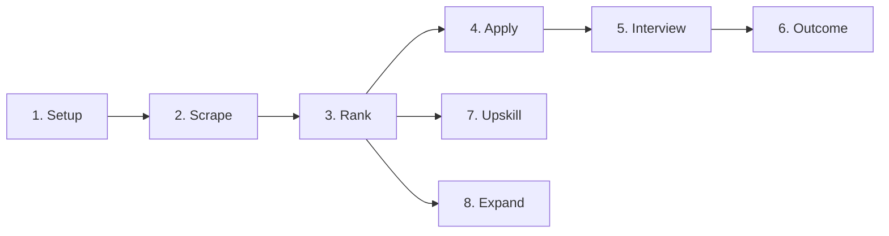

# 🧠 AI Session Starter: FastAPI-backend

*Project memory file for AI assistant session continuity. Auto-referenced by custom instructions.*

---

## 📘 Project Context

**Project:** FastAPI-backend — Open AI Jobs Search
**Type:** Backend API (FastAPI + Supabase/PostgreSQL + LiteLLM)
**Purpose:** Multi-provider AI service for job search: scraping, ATS ranking, tailored CV/cover letter generation, interview prep, outcome tracking, competency expansion, and learning plans.
**Status:** ✅ FASE 5 completada — Provider model listing/selection endpoints implemented and tested

**Core Technologies:**
- FastAPI (async), Pydantic v2, SQLAlchemy 2.0 (async, asyncpg)
- LiteLLM as multi-provider adapter (Anthropic, OpenAI, NVIDIA NIM, LM Studio, Ollama)
- Supabase (PostgreSQL) — Session Pooler or Direct Connection
- APScheduler declared in deps and settings (`scrape_interval_hours`) — **wired in lifespan**
- Bun/TypeScript scrapers from source repo (invoked via subprocess)
- LaTeX (lualatex + xelatex) for CV/cover letter PDF generation

**Source Repo (read-only):** `E:\Dev\PoryectosDeTerceros\ai-job-search`
**Target Repo:** `E:\Dev\PoryectosDeTerceros\open-ai-jobs-search\FastAPI-backend`

**Available AI Capabilities:**
- 🔧 MCP Servers: everything-re (test), secure-filesy (filesystem), sequential-thinking
- 📚 Documentation: Microsoft docs MCP available for Azure/Microsoft products

---

## 🎯 Current State

**Build Status:** ✅ FASE 5 completed
**Server:** Functional at `http://127.0.0.1:8000` (healthcheck at `/api/v1/health`)
**Database:** Initial migration `770526833bdb` + `a1b2c3d4e5f6` (user_model_selection) applied against Supabase (14 tables)
**Tests:** 173 collected → **173 passing, 0 failing**

**Architecture Highlights:**
- App factory pattern (`create_app()`) — no loose `app = FastAPI()`
- Pydantic schemas separate from ORM models (never expose SQLAlchemy directly)
- Dependencies centralized in `app/api/deps.py`
- API versioned from start (`/api/v1/`)
- Custom business exceptions with registered handlers (`AppError`, `NotFoundError`, `ProviderAuthError`, `ProfileIncompleteError`, `ScraperError`, `LLMError`, `LatexCompileError`, `DuplicateError`, `ConfirmationRequiredError`)
- LiteLLM as sole LLM interface (`llm_completion` + `llm_completion_structured`)
- Bun/TS scrapers inherited — invoked via subprocess, not rewritten
- Anti-hallucination guardrails embedded in each LLM service (rank, apply, interview, expand, upskill, add_portal)

**Auth State (REAL):**
- `app/core/security.py` implements custom JWT with `python-jose` + bcrypt (`hash_password`, `verify_password`, `create_access_token`, `decode_access_token`)
- `app/api/deps.py::get_current_user` validates Bearer JWT and returns payload (`{sub, exp}`)
- `get_llm_provider` now **reads from DB** via `provider_credentials` service with Fernet encryption
- Auth endpoints exist: `/auth/register`, `/auth/login` (JWT issuance)
- Ownership of resources: services filter by `user_id=user["sub"]` correctly

---

## 👤 Manual Tasks (Human Required)

| # | Task | Reason |
|---|------|--------|
| 1 | **Configure `.env`** — `DATABASE_URL`, `ANTHROPIC_API_KEY`/`OPENAI_API_KEY`, `JWT_SECRET_KEY` | Secrets — never hardcode |
| 2 | **Install Bun** — for legacy scrapers | OS-level installation |
| 3 | **Install LaTeX** (lualatex + xelatex, TeX Live/MiKTeX) | For `/apply` PDF generation |
| 4 | **Create Supabase project** — connection string, Session Pooler | External service |
| 5 | **Build Bun/TS scrapers** — `bun install` in `app/external/scrapers/*/cli/` | Bun environment |
| 6 | **Test end-to-end flow with real data** | Business validation |

---

## 🚀 API Pipeline (Usage Order)

1. **Setup** (`/setup/*`) — candidate profile (mandatory first)
2. **Scrape** (`/scrape/*`) — job search on portals
3. **Rank** (`/rank/*`) — fit evaluation + shortlist
4. **Apply** (`/apply/*`) — tailored CV + cover letter in LaTeX
5. **Interview** (`/interview/*`) — interview prep
6. **Outcome** (`/outcome/*`) — result tracking
7. **Upskill** (`/upskill/*`) — learning plan (optional, parallel to Rank)
8. **Expand** (`/expand/*`) — competency expansion (optional, parallel to Rank)

Independent config: `/add-portal/*`, `/add-template/*`, `/reset/`, `/providers/*`

**Endpoints by Router (all require JWT via `get_current_user`):**
- `/setup`: profile CRUD, behavioral profile, STAR examples, complete-setup
- `/scrape`: trigger, list runs, list/get jobs
- `/rank`: trigger, list ranked jobs, get evaluation
- `/apply`: trigger, get/list applications
- `/interview`: trigger, get/list preps
- `/outcome`: create, update, get, list, tracker rows
- `/upskill`: trigger, get/list
- `/expand`: trigger, get/list
- `/add-portal`: trigger, get/list skills
- `/add-template`: register, switch, get/list templates
- `/reset`: destructive reset (profile/documents) with `RESET` confirmation
- `/providers`: CRUD credentials, active provider, **list models per provider**, **set/get model selection**
- `/health`: liveness probe (no auth)

---

## 🧠 Technical Memory

**Critical Discoveries:**
- Source repo has 6 Bun/TS scrapers with uniform contract (search + detail, JSON stdout, errors stderr)
- LaTeX templates: moderncv/banking (lualatex) + cover.cls (xelatex) with Lato/Raleway fonts
- `salary_lookup.py` uses fuzzy matching with Danish character normalization
- 7 candidate profile files (~40 fields) → base for Supabase schema
- 9 documented Claude Code commands as basis for Python services
- `/scrape` is a skill, not a command — uses installed CLIs + WebSearch fallback
- `llm_completion_structured` uses `response_format` JSON object + Pydantic validation of raw
- `PORTAL_MAP` in `scrape.py` maps 6 portals: linkedin, freehire, jobbank, jobdanmark, jobindex, jobnet
- `salary_data.json` **DOES NOT EXIST** in repo — `load_data()` does `sys.exit(1)` if missing (breaks tests)
- `settings.documents_dir` and `settings.tracker_path` **NOT DEFINED** in `Settings` — services reference them and fail at runtime (outcome, expand, reset use `hasattr` fallback)

**Known Constraints:**
- Source repo is READ-ONLY — never modify
- No commits without explicit "commit authorized"
- Secrets in `.env`, never hardcoded or committed
- `DATABASE_URL` must use `postgresql+asyncpg://` (not `postgresql://`)
- NO Transaction Pooler (PgBouncer) with asyncpg (breaks prepared statements)
- Routers must import schemas from `app.schemas.*`, not from `app.services.*`
- Without Bun, `/scrape/` fails; without LaTeX, `/apply/` doesn't generate PDFs; without Supabase, no persistence

**Lessons Learned:**
- SQLAlchemy 2.x async engine requires explicit `+asyncpg` driver scheme
- In Pydantic v2, `int | None` fields don't auto-convert empty strings to `None`; use `before_validator`
- In tests with `AsyncSession`, always `await` on `commit()` and `refresh()` (else objects don't persist)
- In tests with `TemporaryDirectory`, assertions on created files must be INSIDE the `with` block
- Avoid implicit upserts in "event logging" services when model allows multiple records per entity
- Use `JSON().with_variant(JSONB(), "postgresql")` for JSONB columns that support SQLite in tests
- In Pydantic frozen, use `PropertyMock` on the class, not patch on instance
- `sys.exit()` in service libraries breaks event loop and tests — raise exception instead

---

## 📋 Progress Log

| Date | Achievement |
|------|-------------|
| 2026-07-12 | ✅ FASE 0 — Source repo audit |
| 2026-07-12 | ✅ FASE 1 — Project scaffolding |
| 2026-07-12 | ✅ FASE 2 — Copy reusable components (6 scrapers, LaTeX, salary) |
| 2026-07-12 | ✅ FASE 3 — Services implemented (setup, scrape, rank, apply, interview, outcome, expand, upskill, add-portal, add-template, reset) |
| 2026-07-13 | ✅ FASE 4 — Initial Alembic migration applied against Supabase |
| 2026-07-13 | ✅ Fix DATABASE_URL, apply router, outcome/reset/upskill tests |
| 2026-07-13 | ✅ Fix rank tests (upsert, FAIL filtering, no_autoflush, await in fixtures) |
| 2026-07-13 | ✅ Auth endpoints created — `/auth/register` and `/auth/login` with JWT |
| 2026-07-13 | ✅ Settings completed — `documents_dir` and `tracker_path` added |
| 2026-07-13 | ✅ `sys.exit()` removed — `salary_lookup.py` raises `NotFoundError` |
| 2026-07-13 | ✅ Test suite 100% green — 155 tests passing (fixes in apply, expand, interview, salary, scrape, smoke) |
| 2026-07-13 | ✅ Syntax errors fixed — auth.py, schemas/auth.py, deps.py (get_db) |
| 2026-07-13 | ✅ APScheduler wired — Periodic scraping scheduler in `app/core/scheduler.py` integrated in `main.py` lifespan |
| 2026-07-13 | ✅ BackgroundTasks implemented — `expand` and `upskill` use BackgroundTasks with `status` field in DB; `apply`, `interview`, `add-portal` need migrations |
| 2026-07-13 | ✅ Real `get_llm_provider` — Created `app/services/provider_credentials.py` with Fernet encryption, updated `get_llm_provider` in `deps.py` to query DB, added `get_provider_kwargs` helper in `llm/adapter.py` |
| 2026-07-13 | ✅ Strict input validation — Added validators for URLs (LinkedIn, GitHub), email (EmailStr), phone (E.164), dates (YYYY-MM/YYYY-MM-DD) in `profile.py`, `scrape.py` |
| 2026-07-13 | ✅ Structured logging — Created `app/core/logging.py` with structlog config, integrated in `main.py` lifespan, installed `structlog` dependency |
| 2026-07-13 | ✅ LLM Provider Management — Created `app/api/v1/providers.py` with CRUD credentials per provider, active provider endpoint, integrated in v1 router |
| 2026-07-13 | ✅ **FASE 5 — Provider Model Listing/Selection** — Added `UserModelSelection` model, migration `a1b2c3d4e5f6`, extended `ProviderInfo` with `static_models` (curated Anthropic list), new schemas (`ModelInfo`, `ModelListOut`, `SetModelSelection`, `ActiveModelOut`), service `provider_models.py` with live HTTP calls + static fallback, 3 endpoints (`GET /{provider}/models`, `PUT /{provider}/model`, `GET /me/model`), 18 new tests passing |

---

## 🔧 Development Environment

**Common Commands:**
- `uvicorn app.main:create_app --factory --reload` — dev server
- `pytest` — tests
- `ruff check .` / `ruff format .` — lint + format
- `alembic upgrade head` — migrations

**Key Files:**
- `app/main.py` — app factory
- `app/core/settings.py` — pydantic-settings
- `app/core/security.py` — JWT + bcrypt
- `app/llm/adapter.py` — LiteLLM wrapper
- `app/db/session.py` — SQLAlchemy async engine
- `app/db/models.py` — 14 ORM models (User, ProviderCredential, UserModelSelection, CandidateProfile, BehavioralProfile, StarExample, JobPosting, ScrapeRun, RankEvaluation, Application, InterviewPrep, Outcome, CompetencyExpansion, Upskill)
- `app/api/deps.py` — centralized FastAPI dependencies
- `app/exceptions.py` — business exceptions + handlers
- `alembic/versions/770526833bdb_initial_schema.py` — initial migration
- `alembic/versions/a1b2c3d4e5f6_add_user_model_selection_table.py` — model selection migration

**Setup Requirements:**
- Python 3.11+ (venv in `.venv`)
- Bun (for legacy scrapers)
- LaTeX (lualatex + xelatex) for CV/cover letter
- Supabase project (Session Pooler or Direct Connection)
- `.env` with `DATABASE_URL`, `ANTHROPIC_API_KEY`/`OPENAI_API_KEY`, `JWT_SECRET_KEY`

---

## 🎯 Completion Plan (Next Steps)

| Phase | Task | Status |
|-------|------|--------|
| 6 | **BackgroundTasks for apply/interview/add-portal** — Add `status` field + migration, wire BackgroundTasks | ⏳ Pending |
| 6 | **APScheduler job persistence** — Store scheduled jobs in DB for survival across restarts | ⏳ Pending |
| 6 | **Webhook/Callback for async job completion** — Notify frontend when background jobs finish | ⏳ Pending |
| 7 | **Rate limiting & quotas** — Per-user/provider rate limits on LLM calls | ⏳ Pending |
| 7 | **Observability** — OpenTelemetry tracing, Prometheus metrics, structured logs correlation | ⏳ Pending |
| 7 | **API Documentation** — OpenAPI enhancements, example requests/responses | ⏳ Pending |
| 8 | **Integration Tests** — Full pipeline E2E tests with real providers (mocked) | ⏳ Pending |
| 8 | **Load Testing** — Locust/k6 scripts for concurrent users | ⏳ Pending |
| 8 | **CI/CD Pipeline** — GitHub Actions: lint, test, migrate, deploy | ⏳ Pending |

> **Note:** FASE 5 (Provider Model Listing/Selection) is complete. The next priority is FASE 6: completing BackgroundTasks for remaining endpoints and making APScheduler persistent.
