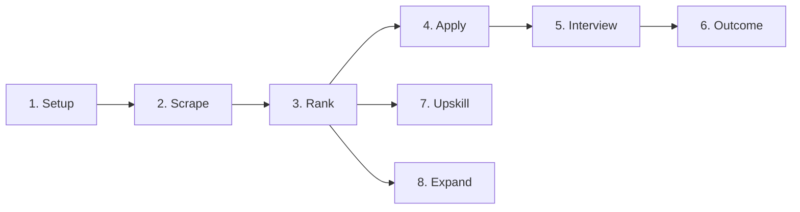

# 🧠 AI Session Starter: FastAPI-backend

*Project memory file for AI assistant session continuity. Auto-referenced by custom instructions.*

---

## 📘 Project Context

**Project:** FastAPI-backend — Open AI Jobs Search
**Type:** Backend API (FastAPI + Supabase + LiteLLM)
**Purpose:** Servicio multi-proveedor de IA para búsqueda de empleos: scraping, ranking ATS, generación de CV/carta tailored, preparación de entrevistas, registro de outcomes, expansión de competencias y plan de aprendizaje.
**Status:** ✅ FASE 4 completada — app funcional en `http://127.0.0.1:8000` con todos los endpoints implementados y migraciones aplicadas.

**Core Technologies:**
- FastAPI (async), Pydantic v2, SQLAlchemy 2.0 (async, asyncpg)
- LiteLLM como capa adaptadora multi-proveedor (Anthropic, OpenAI, NVIDIA NIM, LM Studio)
- Supabase (PostgreSQL) — Session Pooler o Direct Connection
- APScheduler para scraping periódico
- Bun/TypeScript scrapers heredados del repo fuente (invocados vía subprocess)

**Repo fuente (solo lectura):** `E:\Dev\PoryectosDeTerceros\ai-job-search`
**Repo destino:** `E:\Dev\PoryectosDeTerceros\open-ai-jobs-search\FastAPI-backend`

**Available AI Capabilities:**
- 🔧 MCP Servers: everything-re (test), secure-filesy (filesystem), sequential-thinking
- 📚 Documentation: Microsoft docs MCP available for Azure/Microsoft products

---

## 🎯 Current State

**Build Status:** ✅ FASE 4 completada
**Server:** Funcional en `http://127.0.0.1:8000` (healthcheck en `/api/v1/health`)
**Database:** Migración inicial `770526833bdb` aplicada contra Supabase (13 tablas)
**Tests:** 110 passing, 45 failing (pendientes de revisión en `test_expand.py`, `test_interview.py`, `test_salary.py`, `test_scrape.py`)

**Architecture Highlights:**
- App factory pattern (`create_app()`) — no `app = FastAPI()` suelto
- Schemas Pydantic separados de modelos ORM (nunca exponer SQLAlchemy directo)
- Dependencias centralizadas en `api/deps.py`
- API versionada desde el arranque (`/api/v1/`)
- Excepciones de negocio propias con handlers registrados
- LiteLLM como única interfaz al LLM (nunca SDK directo de proveedor)
- Scrapers Bun/TS heredados — se invocan por subprocess, no se reescriben

---

## 🚀 Pipeline de la API (orden de uso)

1. **Setup** (`/setup/*`) — perfil candidato (obligatorio primero)
2. **Scrape** (`/scrape/*`) — búsqueda de jobs en portales
3. **Rank** (`/rank/*`) — evaluación de fit + shortlist
4. **Apply** (`/apply/*`) — CV + carta tailored en LaTeX
5. **Interview** (`/interview/*`) — prep de entrevista
6. **Outcome** (`/outcome/*`) — registro de resultados
7. **Upskill** (`/upskill/*`) — plan de aprendizaje (opcional, paralelo a Rank)
8. **Expand** (`/expand/*`) — expansión de competencias (opcional, paralelo a Rank)

Configuración independiente: `/add-portal/*`, `/add-template/*`, `/reset/`

---

## 🧠 Technical Memory

**Critical Discoveries:**
- Repo fuente tiene 6 scrapers Bun/TS con contrato uniforme (search + detail, JSON stdout, errores stderr)
- Plantillas LaTeX: moderncv/banking (lualatex) + cover.cls (xelatex) con fuentes Lato/Raleway
- `salary_lookup.py` usa fuzzy matching con normalización de caracteres daneses
- 7 archivos de perfil del candidato (~40 campos) → base para esquema Supabase
- 9 comandos Claude Code documentados como base para servicios Python
- `/scrape` es skill, no comando — usa CLIs instalados + WebSearch fallback

**Known Constraints:**
- Repo fuente es SOLO LECTURA — nunca modificar
- No commits sin "commit autorizado" explícito
- Secrets en `.env`, nunca hardcodeados ni commiteados
- `DATABASE_URL` debe usar `postgresql+asyncpg://` (no `postgresql://`)
- NO usar Transaction Pooler de PgBouncer con asyncpg (rompe prepared statements)
- Los routers deben importar schemas desde `app.schemas.*`, no desde `app.services.*`

**Lessons Learned:**
- SQLAlchemy 2.x async engine requiere explícito `+asyncpg` driver scheme
- En Pydantic v2, los campos `int | None` no convierten automáticamente strings vacíos a `None`; usar `before_validator`
- En tests con `AsyncSession`, siempre `await` en `commit()` y `refresh()` (si no, los objetos no se persisten)
- En tests con `TemporaryDirectory`, las aserciones sobre archivos creados deben estar DENTRO del bloque `with`
- Evitar upserts implícitos en servicios de "registro de eventos" cuando el modelo permite múltiples registros por entidad
- Usar `JSON().with_variant(JSONB(), "postgresql")` para columnas JSONB que soporten SQLite en tests
- En Pydantic frozen, usar `PropertyMock` sobre la clase, no patch sobre la instancia

---

## 📋 Progress

| Date | Achievement |
|------|-------------|
| 2026-07-12 | ✅ FASE 0 — Auditoría del repo fuente |
| 2026-07-12 | ✅ FASE 1 — Scaffolding del proyecto |
| 2026-07-12 | ✅ FASE 2 — Copiar componentes reutilizables (6 scrapers, LaTeX, salary) |
| 2026-07-12 | ✅ FASE 3 — Servicios implementados (setup, scrape, rank, apply, interview, outcome, expand, upskill, add-portal, add-template, reset) |
| 2026-07-13 | ✅ FASE 4 — Migración inicial de Alembic aplicada contra Supabase |
| 2026-07-13 | ✅ Fix DATABASE_URL, router apply, tests de outcome, reset y upskill |
| 2026-07-13 | ✅ Fix tests de rank (upsert, FAIL filtering, no_autoflush, await en fixtures) |

---

## 🔧 Development Environment

**Common Commands:**
- `uvicorn app.main:create_app --factory --reload` — dev server
- `pytest` — tests
- `ruff check .` / `ruff format .` — lint + format
- `alembic upgrade head` — migraciones

**Key Files:**
- `app/main.py` — app factory
- `app/core/settings.py` — pydantic-settings
- `app/llm/adapter.py` — LiteLLM wrapper
- `app/db/session.py` — SQLAlchemy async engine
- `app/api/deps.py` — dependencias FastAPI centralizadas
- `app/exceptions.py` — excepciones de negocio + handlers

**Setup Requirements:**
- Python 3.11+
- Bun (para scrapers heredados)
- LaTeX (lualatex + xelatex) para CV/carta
- Supabase project (Session Pooler o Direct Connection)

---

*This file serves as persistent project memory for enhanced AI assistant session continuity with MCP server integration.*
