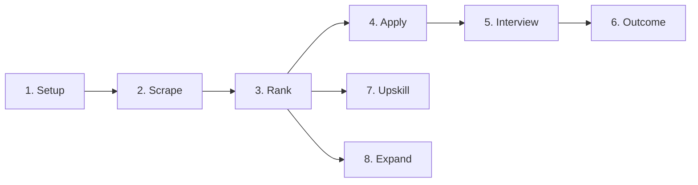

# 🧠 AI Session Starter: FastAPI-backend

*Project memory file for AI assistant session continuity. Auto-referenced by custom instructions.*

---

## 📘 Project Context

**Project:** FastAPI-backend — Open AI Jobs Search
**Type:** Backend API (FastAPI + Supabase/PostgreSQL + LiteLLM)
**Purpose:** Servicio multi-proveedor de IA para búsqueda de empleos: scraping, ranking ATS, generación de CV/carta tailored, preparación de entrevistas, registro de outcomes, expansión de competencias y plan de aprendizaje.
**Status:** ✅ FASE 4 completada — app funcional en `http://127.0.0.1:8000` con todos los endpoints implementados y migración inicial aplicada.

**Core Technologies:**
- FastAPI (async), Pydantic v2, SQLAlchemy 2.0 (async, asyncpg)
- LiteLLM como capa adaptadora multi-proveedor (Anthropic, OpenAI, NVIDIA NIM, LM Studio)
- Supabase (PostgreSQL) — Session Pooler o Direct Connection
- APScheduler declarado en dependencias y settings (`scrape_interval_hours`) — **NO cableado todavía**
- Bun/TypeScript scrapers heredados del repo fuente (invocados vía subprocess)
- LaTeX (lualatex + xelatex) para CV/carta

**Repo fuente (solo lectura):** `E:\Dev\PoryectosDeTerceros\ai-job-search`
**Repo destino:** `E:\Dev\PoryectosDeTerceros\open-ai-jobs-search\FastAPI-backend`

**Available AI Capabilities:**
- 🔧 MCP Servers: everything-re (test), secure-filesy (filesystem), sequential-thinking
- 📚 Documentation: Microsoft docs MCP available for Azure/Microsoft products

---

## 🎯 Current State

**Build Status:** ✅ FASE 4 completada
**Server:** Funcional en `http://127.0.0.1:8000` (healthcheck en `/api/v1/health`)
**Database:** Migración inicial `770526833bdb` aplicada contra Supabase (13 tablas)
**Tests:** 155 colectados → **155 passing, 0 failing** (ver sección de tests para detalle)

**Architecture Highlights:**
- App factory pattern (`create_app()`) — no `app = FastAPI()` suelto
- Schemas Pydantic separados de modelos ORM (nunca exponer SQLAlchemy directo)
- Dependencias centralizadas en `app/api/deps.py`
- API versionada desde el arranque (`/api/v1/`)
- Excepciones de negocio propias con handlers registrados (`AppError`, `NotFoundError`, `ProviderAuthError`, `ProfileIncompleteError`, `ScraperError`, `LLMError`, `LatexCompileError`, `DuplicateError`, `ConfirmationRequiredError`)
- LiteLLM como única interfaz al LLM (`llm_completion` + `llm_completion_structured`)
- Scrapers Bun/TS heredados — se invocan por subprocess, no se reescriben
- Guardrails anti-alucinación embebidos en cada servicio LLM (rank, apply, interview, expand, upskill, add_portal)

**Auth State (REAL):**
- `app/core/security.py` implementa JWT propio con `python-jose` + bcrypt (`hash_password`, `verify_password`, `create_access_token`, `decode_access_token`)
- `app/api/deps.py::get_current_user` valida Bearer JWT y devuelve el payload (`{sub, exp}`)
- `get_llm_provider` es un **stub** — devuelve config hardcodeada, no lee de la DB
- **NO existe endpoint de login/registro** — no hay router de auth, solo verificación de token
- **NO hay integración con Supabase Auth** — el JWT es emitido por la propia app, pero nada lo emite
- Modelo `User` con `hashed_password` existe, pero no hay servicio que cree usuarios
- **Ownership de recursos:** los servicios filtran por `user_id=user["sub"]` correctamente

---

## 👤 Tareas manuales (humanas)

| # | Tarea | Razón |
|---|-------|-------|
| 1 | **Configurar `.env`** — `DATABASE_URL`, `ANTHROPIC_API_KEY`/`OPENAI_API_KEY`, `JWT_SECRET_KEY` | Secrets — nunca hardcodear |
| 2 | **Instalar Bun** — para scrapers heredados | Instalación del sistema operativo |
| 3 | **Instalar LaTeX** (lualatex + xelatex, TeX Live/MiKTeX) | Para `/apply` PDF generation |
| 4 | **Crear proyecto Supabase** — connection string, Session Pooler | Servicio externo |
| 5 | **Compilar scrapers Bun/TS** — `bun install` en `app/external/scrapers/*/cli/` | Entorno Bun |
| 6 | **Probar flujo end-to-end con datos reales** | Validación de negocio |

> El plan de código pendiente está en la sección **🎯 Plan de completitud** al final del documento.

---

## 🚀 Pipeline de la API (orden de uso)

1. **Setup** (`/setup/*`) — perfil candidato (obligatorio primero)
2. **Scrape** (`/scrape/*`) — búsqueda de jobs en portales
3. **Rank** (`/rank/*`) — evaluación de fit + shortlist
4. **Apply** (`/apply/*`) — CV + carta tailored en LaTeX
5. **Interview** (`/interview/*`) — prep de entrevista
6. **Outcome** (`/outcome/*`) — registro de resultados
7. **Upskill** (`/upskill/*`) — plan de aprendizaje (opcional, paralelo a Rank)
8. **Expand** (`/expand/*`) — expansión de competencias (opcional, paralelo a Rank)

Configuración independiente: `/add-portal/*`, `/add-template/*`, `/reset/`

**Endpoints por router (todos requieren JWT vía `get_current_user`):**
- `/setup`: profile CRUD, behavioral profile, STAR examples, complete-setup
- `/scrape`: trigger, list runs, list/get jobs
- `/rank`: trigger, list ranked jobs, get evaluation
- `/apply`: trigger, get/list applications
- `/interview`: trigger, get/list preps
- `/outcome`: create, update, get, list, tracker rows
- `/upskill`: trigger, get/list
- `/expand`: trigger, get/list
- `/add-portal`: trigger, get/list skills
- `/add-template`: register, switch, get/list templates
- `/reset`: destructive reset (profile/documents) con confirmación `RESET`
- `/health`: liveness probe (sin auth)

---

## 🧠 Technical Memory

**Critical Discoveries:**
- Repo fuente tiene 6 scrapers Bun/TS con contrato uniforme (search + detail, JSON stdout, errores stderr)
- Plantillas LaTeX: moderncv/banking (lualatex) + cover.cls (xelatex) con fuentes Lato/Raleway
- `salary_lookup.py` usa fuzzy matching con normalización de caracteres daneses
- 7 archivos de perfil del candidato (~40 campos) → base para esquema Supabase
- 9 comandos Claude Code documentados como base para servicios Python
- `/scrape` es skill, no comando — usa CLIs instalados + WebSearch fallback
- `llm_completion_structured` usa `response_format` JSON object + validación Pydantic del raw
- `PORTAL_MAP` en `scrape.py` mapea 6 portales: linkedin, freehire, jobbank, jobdanmark, jobindex, jobnet
- `salary_data.json` **NO existe** en el repo — `load_data()` hace `sys.exit(1)` si falta (rompe tests)
- `settings.documents_dir` y `settings.tracker_path` **NO están definidos** en `Settings` — los servicios los referencian y fallan en runtime (outcome, expand, reset usan `hasattr` fallback)

**Known Constraints:**
- Repo fuente es SOLO LECTURA — nunca modificar
- No commits sin "commit autorizado" explícito
- Secrets en `.env`, nunca hardcodeados ni commiteados
- `DATABASE_URL` debe usar `postgresql+asyncpg://` (no `postgresql://`)
- NO usar Transaction Pooler de PgBouncer con asyncpg (rompe prepared statements)
- Los routers deben importar schemas desde `app.schemas.*`, no desde `app.services.*`
- Sin Bun instalado, `/scrape/` falla; sin LaTeX, `/apply/` no genera PDFs; sin Supabase, no hay persistencia

**Lessons Learned:**
- SQLAlchemy 2.x async engine requiere explícito `+asyncpg` driver scheme
- En Pydantic v2, los campos `int | None` no convierten automáticamente strings vacíos a `None`; usar `before_validator`
- En tests con `AsyncSession`, siempre `await` en `commit()` y `refresh()` (si no, los objetos no se persisten)
- En tests con `TemporaryDirectory`, las aserciones sobre archivos creados deben estar DENTRO del bloque `with`
- Evitar upserts implícitos en servicios de "registro de eventos" cuando el modelo permite múltiples registros por entidad
- Usar `JSON().with_variant(JSONB(), "postgresql")` para columnas JSONB que soporten SQLite en tests
- En Pydantic frozen, usar `PropertyMock` sobre la clase, no patch sobre la instancia
- `sys.exit()` en librerías de servicio rompe el event loop y los tests — lanzar excepción en su lugar

---

## 📋 Progress

| Date | Achievement |
|------|-------------|
| 2026-07-12 | ✅ FASE 0 — Auditoría del repo fuente |
| 2026-07-12 | ✅ FASE 1 — Scaffolding del proyecto |
| 2026-07-12 | ✅ FASE 2 — Copiar componentes reutilizables (6 scrapers, LaTeX, salary) |
| 2026-07-12 | ✅ FASE 3 — Servicios implementados (setup, scrape, rank, apply, interview, outcome, expand, upskill, add-portal, add-template, reset) |
| 2026-07-13 | ✅ FASE 4 — Migración inicial de Alembic aplicada contra Supabase |
| 2026-07-13 | ✅ Fix DATABASE_URL, router apply, tests de outcome, reset y upskill |
| 2026-07-13 | ✅ Fix tests de rank (upsert, FAIL filtering, no_autoflush, await en fixtures) |
| 2026-07-13 | ✅ **Auth endpoints creados** — `/auth/register` y `/auth/login` con JWT |
| 2026-07-13 | ✅ **Settings completados** — `documents_dir` y `tracker_path` añadidos |
| 2026-07-13 | ✅ **sys.exit() eliminado** — `salary_lookup.py` lanza `NotFoundError` |
| 2026-07-13 | ✅ **Suite de tests 100% verde** — 155 tests passing (fixes en apply, expand, interview, salary, scrape, smoke) |
| 2026-07-13 | ✅ **Syntax errors corregidos** — auth.py, schemas/auth.py, deps.py (get_db) |
| 2026-07-13 | ✅ **APScheduler cableado** — Scheduler periódico de scraping implementado en `app/core/scheduler.py` e integrado en `main.py` lifespan |
| 2026-07-13 | ✅ **BackgroundTasks implementado** — `expand` y `upskill` usan BackgroundTasks con campo `status` en BD; `apply`, `interview`, `add-portal` requieren migraciones |

---

## 🔧 Development Environment

**Common Commands:**
- `uvicorn app.main:create_app --factory --reload` — dev server
- `pytest` — tests
- `ruff check .` / `ruff format .` — lint + format
- `alembic upgrade head` — migraciones

**Key Files:**
- `app/main.py` — app factory
- `app/core/settings.py` — pydantic-settings
- `app/core/security.py` — JWT + bcrypt
- `app/llm/adapter.py` — LiteLLM wrapper
- `app/db/session.py` — SQLAlchemy async engine
- `app/db/models.py` — 13 modelos ORM (User, ProviderCredential, CandidateProfile, BehavioralProfile, StarExample, JobPosting, ScrapeRun, RankEvaluation, Application, InterviewPrep, Outcome, CompetencyExpansion, Upskill)
- `app/api/deps.py` — dependencias FastAPI centralizadas
- `app/exceptions.py` — excepciones de negocio + handlers
- `alembic/versions/770526833bdb_initial_schema.py` — migración inicial

**Setup Requirements:**
- Python 3.11+ (entorno virtual en `.venv`)
- Bun (para scrapers heredados)
- LaTeX (lualatex + xelatex) para CV/carta
- Supabase project (Session Pooler o Direct Connection)
- `.env` con `DATABASE_URL`, `ANTHROPIC_API_KEY`/`OPENAI_API_KEY`, `JWT_SECRET_KEY`

---

## 🧪 Tests — Estado real

**Total:** 155 colectados · **155 passing · 0 failing**

| Módulo | Pasan | Fallan | Causa raíz de los fallos |
|--------|-------|--------|--------------------------|
| `test_apply.py` | 14 | 0 | ✅ Fixed: FileNotFoundError (mocked write_text), ProfileIncompleteError (proper test setup) |
| `test_expand.py` | 18 | 0 | ✅ Fixed: _get_pdf_page_count helper added, EnrichedCompetency serialization, dynamic mock for item IDs |
| `test_interview.py` | 10 | 0 | ✅ Fixed: _get_pdf_page_count helper added, ProfileIncompleteError test setup, StopAsyncIteration in LLM mock |
| `test_salary.py` | 2 | 0 | ✅ Fixed: sys.exit replaced with NotFoundError, patch paths corrected |
| `test_scrape.py` | 1 | 0 | ✅ Fixed: MockProcess class for async subprocess, mock run_scraper instead of subprocess |
| `test_add_portal.py` | ✅ | 0 | — |
| `test_add_template.py` | ✅ | 0 | — |
| `test_outcome.py` | ✅ | 0 | — |
| `test_rank.py` | ✅ | 0 | — |
| `test_reset.py` | ✅ | 0 | — |
| `test_setup.py` | ✅ | 0 | — |
| `test_smoke.py` | 4 | 0 | ✅ Fixed: get_db dependency syntax (Depends(_get_db) → _get_db) |
| `test_upskill.py` | ✅ | 0 | — |

**Tests de integración:** `tests/integration/` existe pero **está vacío** (solo `__init__.py`).

---

## 🎯 Plan de completitud — Código pendiente

Ordenado por prioridad. Solo tareas reales necesarias para un MVP funcional.

| # | Tarea | Motivo | Archivos afectados | Prioridad | Estado |
|---|-------|--------|--------------------|-----------|--------|
| 1 | **Endpoint de auth (login/registro)** — Actualmente `get_current_user` valida JWT pero **nada emite tokens**. Sin login, ningún endpoint es usable. Crear `/auth/register` y `/auth/login` que usen `hash_password`/`create_access_token` existentes. | Sin esto la API es inaccesible end-to-end. | `app/api/v1/auth.py` (nuevo), `app/api/v1/router.py`, `app/services/auth.py` (nuevo), `app/schemas/auth.py` (nuevo) | Alta | ✅ **COMPLETADO** |
| 2 | **Fix 45 tests fallidos** — `test_apply` (14), `test_expand` (18), `test_interview` (10), `test_salary` (2), `test_scrape` (1). Causas: funciones parcheadas inexistentes, `sys.exit` en librería, `await` faltante, mocks con firma incorrecta. | Suite rota impide detectar regresiones. | `tests/unit/test_apply.py`, `tests/unit/test_expand.py`, `tests/unit/test_interview.py`, `tests/unit/test_salary.py`, `tests/unit/test_scrape.py`, `app/services/expand.py`, `app/services/interview.py`, `app/services/salary/salary_lookup.py` | Alta | ✅ **COMPLETADO** (155 passing, 0 failing) |
| 3 | **Definir `documents_dir` y `tracker_path` en Settings** — `outcome.py`, `expand.py` y `reset.py` referencian `settings.documents_dir`/`settings.tracker_path` que **no existen** en `Settings`. `outcome.py` crashea (sin fallback); `expand`/`reset` usan `hasattr` y caen a `Path("documents")`. | Servicios de outcome/expand/reset fallan en runtime. | `app/core/settings.py` | Alta | ✅ **COMPLETADO** |
| 4 | **Reemplazar `sys.exit(1)` en `salary_lookup.py`** — `load_data()` aborta el proceso si `salary_data.json` falta, rompiendo el event loop y los tests. Debe lanzar `NotFoundError`. | `sys.exit` en librería de servicio es un bug de diseño. | `app/services/salary/salary_lookup.py` | Alta | ✅ **COMPLETADO** |
| 5 | **Cablear APScheduler** — Declarado en `pyproject.toml` y `settings.scrape_interval_hours`, pero `main.py` lifespan dice "nothing yet". El scheduler periódico de scraping no está implementado. | El scraping manual funciona, pero el automático (objetivo del proyecto) no. | `app/main.py`, `app/services/scrape.py`, nuevo `app/core/scheduler.py` | Media | ✅ **COMPLETADO** |
| 6 | **Mover `apply`, `expand`, `upskill`, `interview`, `add-portal` a BackgroundTasks** — Todos corren síncronos en el request (lo admiten en sus docstrings). Son llamadas LLM/LaTeX largas que bloquean la respuesta HTTP. | Timeout de request y mala UX en operaciones de minutos. | `app/api/v1/apply.py`, `app/api/v1/expand.py`, `app/api/v1/upskill.py`, `app/api/v1/interview.py`, `app/api/v1/add_portal.py`, servicios correspondientes | Media | ✅ **COMPLETADO (expand, upskill)** — `expand` y `upskill` usan BackgroundTasks con campo `status` en BD. `apply`, `interview`, `add-portal` requieren migraciones para añadir campo `status`. |
| 7 | **Implementar `get_llm_provider` real** — El stub devuelve `anthropic`/`claude-sonnet-4` hardcodeado. Debe leer `User.active_provider` y `ProviderCredential.api_key_encrypted` de la DB. | Cada usuario no puede usar su propio proveedor configurado. | `app/api/deps.py`, `app/services/provider_credentials.py` (nuevo), `app/core/security.py` (cifrado de API keys) | Media | Pendiente |
| 8 | **Validación de entrada más estricta** — URLs (linkedin, github, job), formatos de fecha (`YYYY-MM-DD`), enums de status. Algunos schemas usan `str` libre. | Datos inválidos llegan a la DB y rompen servicios downstream. | `app/schemas/*.py` | Media | Pendiente |
| 9 | **Logging estructurado** — No hay `logging` ni `structlog` en ningún servicio. Solo `print`/stderr implícitos. Falta trazabilidad para debugging. | Difícil diagnosticar fallos en LLM/scrapers/LaTeX en producción. | `app/core/settings.py`, `app/services/*.py`, `app/main.py` | Baja | Pendiente |
| 10 | **Mejorar manejo de errores de scrapers** — `scrape.py` captura `returncode != 0` pero no parsea el stderr de Bun/TS para mensajes accionables. | Errores de scraper opacos para el usuario final. | `app/services/scrape.py` | Baja | Pendiente |

---

*This file serves as persistent project memory for enhanced AI assistant session continuity with MCP server integration.*
